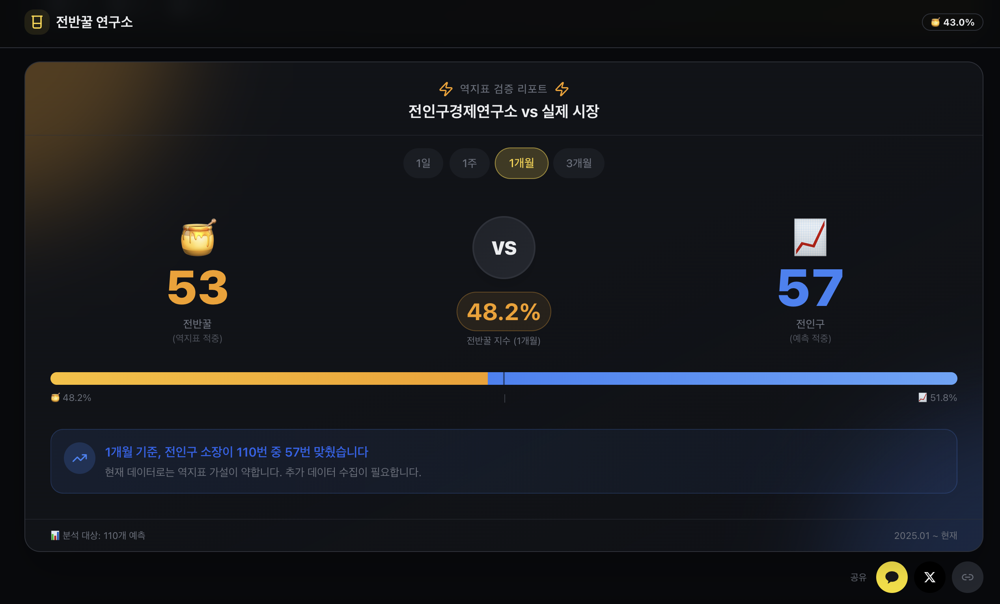
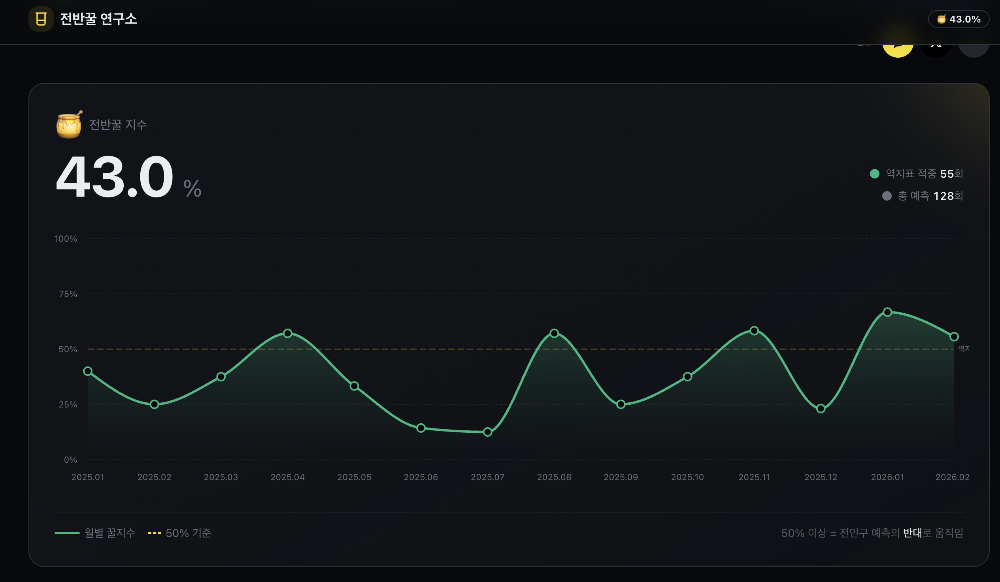

# 🍯 전반꿀 연구소 (JunBanKkul Lab)

## 전인구 소장 예측, 반대로 하면 진짜 돈 벌까?

주식/코인 커뮤니티의 유명한 밈 **"전반꿀"**(전인구 반대로 하면 꿀)을 실제 데이터로 검증하는 프로젝트입니다.

> **현재 역지표 적중률: 32.3%** (127개 예측 분석 기준)

🔗 **[jbklab.vercel.app](https://jbklab.vercel.app)** — 지금 바로 확인하기





---

## 📖 배경

전인구경제연구소는 유튜브에서 시장 전망을 공유하는 채널입니다. 투자 커뮤니티에서는 오래전부터 이런 밈이 돌았죠:

> "전인구가 오른다고 하면 내린다"
> "전인구 반대로 하면 꿀"

**과연 사실일까요?**

궁금해서 직접 데이터로 검증해봤습니다.

---

## 🔬 어떻게 동작하나요?

```
📺 YouTube API     →  영상 제목 수집
        ↓
🤖 GPT-4o-mini    →  예측 방향 추출 (상승/하락/중립)
        ↓
📊 yfinance       →  실제 시장 가격 조회
        ↓
⚖️ 비교 분석      →  1일/1주/1개월/3개월 후 결과
        ↓
🍯 전반꿀 지수    →  역지표 유효성 계산
```

### 분석 기간
- **1일 후**: 단기 트레이더 관점
- **1주 후**: 스윙 트레이더 관점
- **1개월 후**: 중기 투자자 관점 (기본값)
- **3개월 후**: 장기 투자자 관점

---

## ✨ 주요 기능

| 기능 | 설명 |
|------|------|
| **전반꿀 지수** | 역지표 적중률 (50% 이상이면 역지표 유효) |
| **기간별 분석** | 1일/1주/1개월/3개월 탭으로 전환 |
| **종목별 통계** | 비트코인, 코스피, 나스닥, 개별 종목별 분석 |
| **커뮤니티 투표** | 다음 예측 방향 투표 참여 |
| **실시간 업데이트** | GitHub Actions로 자동 수집 |

---

## 🛠 기술 스택

| 영역 | 기술 |
|------|------|
| **Frontend** | Next.js 14 (App Router), React 18, TypeScript |
| **Styling** | Tailwind CSS, shadcn/ui |
| **Database** | Supabase (PostgreSQL) |
| **AI/ML** | OpenAI GPT-4o-mini (영상 분석) |
| **Data** | YouTube Data API, yfinance |
| **Deploy** | Vercel |
| **CI/CD** | GitHub Actions |

---

## 🚀 로컬에서 실행하기

### 요구사항
- Node.js 18+
- pnpm (권장)
- Python 3.9+ (데이터 수집용)

### 설치

```bash
# 저장소 클론
git clone https://github.com/yundoun/junbankkullab.git
cd junbankkullab

# 의존성 설치
pnpm install

# 환경 변수 설정
cp .env.example .env.local

# 개발 서버 실행
pnpm dev
```

### 환경 변수

```env
NEXT_PUBLIC_SUPABASE_URL=your_supabase_url
NEXT_PUBLIC_SUPABASE_ANON_KEY=your_supabase_key
YOUTUBE_API_KEY=your_youtube_api_key
OPENAI_API_KEY=your_openai_api_key
```

---

## 📁 프로젝트 구조

```
src/
├── app/                    # Next.js App Router
│   ├── api/                # API Routes
│   └── video/[videoId]/    # 상세 페이지
├── components/
│   ├── ui/                 # shadcn/ui 컴포넌트
│   └── domain/             # 도메인 컴포넌트
│       ├── hero-scoreboard.tsx
│       ├── vote-card.tsx
│       ├── today-signal.tsx
│       └── ...
├── lib/                    # 유틸리티
└── styles/                 # 글로벌 스타일

scripts/
├── analyze-v3.ts           # 영상 분석 스크립트
├── market_data.py          # 시장 데이터 수집
└── backfill-multi-period.ts # 백필 스크립트
```

---

## 🤝 기여하기

기여를 환영합니다! 

1. Fork the repository
2. Create your feature branch (`git checkout -b feature/amazing-feature`)
3. Commit your changes (`git commit -m 'Add amazing feature'`)
4. Push to the branch (`git push origin feature/amazing-feature`)
5. Open a Pull Request

자세한 내용은 [CONTRIBUTING.md](./CONTRIBUTING.md)를 참조하세요.

---

## ⚠️ 면책조항

**이 프로젝트는 순수하게 엔터테인먼트 및 교육 목적입니다.**

- ❌ 투자 조언이 아닙니다
- ❌ 실제 투자 결정에 사용하지 마세요
- ✅ 밈을 데이터로 검증하는 재미있는 실험입니다

---

## 📜 라이선스

MIT License

---

<div align="center">

**"Talk is cheap. Show me the data."**

[🔗 Live Demo](https://jbklab.vercel.app) · [🐛 Report Bug](https://github.com/yundoun/junbankkullab/issues) · [💡 Request Feature](https://github.com/yundoun/junbankkullab/issues)

</div>
